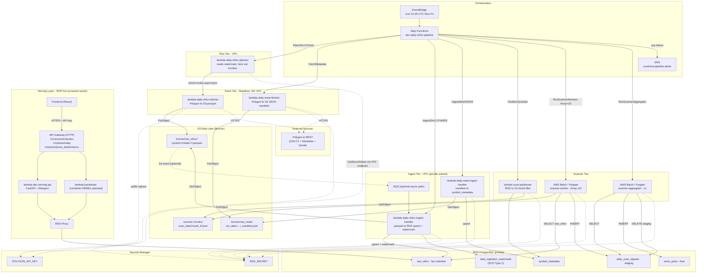

# TradLyte Data Platform — Architecture & Engineering Reference

> **Document owner:** TradLyte Platform Team
> **Status:** Living document — reflects post-decoupling state (Q2 2026)
> **Scope:** Backend data platform (`cloud/`) + local dev stack (`local/`)
> **Audience:** Backend / Data / Cloud engineers, SRE, Security reviewers
> **Classification:** Internal — Proprietary (see `LICENSE`)

---

## 1. Executive Summary

TradLyte is a serverless, event-driven financial-market data platform implemented on AWS. It follows a **Medallion + Lambda Architecture** pattern:

- **Batch Layer** — ingests daily OHLCV and symbol metadata, materializes multi-timeframe views on demand, runs strategy scanning at market-close.
- **Serving Layer** — HTTP APIs for screener + picks (live), with backtest endpoint in planned state.
- **Speed Layer** — designed, archived for MVP (Kinesis/Flink path in `cloud/speed_layer/Archive/`).

The platform's mission statement — **"Clarity Over Noise, Purpose Over Profit"** — drives two architectural non-negotiables:
1. No real-time streaming in the MVP (keeps signal quality high, cost bounded).
2. Strict separation between **fetch (stateless, no VPC)** and **ingest (VPC, stateful)** so that external egress and private DB access never share blast radius.

**Current cost envelope:** ~$69/month in the `dev-` account (Batch ~$59 + Serving ~$10).

---

## 2. High-Level Architecture

The authoritative diagram lives at [`docs/data_architecture.mmd`](docs/data_architecture.mmd) and is embedded below.



---

## 3. Component Inventory

### 3.1 Batch Layer (Production)

| Tier | Component | AWS Resource | Runtime | Network | Code |
|---|---|---|---|---|---|
| Fetch (OHLCV) | `dev-batch-daily-ohlcv-fetcher` | Lambda (zip) | Python 3.11 / x86_64 | **No VPC** (public egress) | `cloud/batch_layer/fetching/lambda_functions/daily_ohlcv_fetcher.py` |
| Fetch (Meta) | `dev-batch-daily-meta-fetcher` | Lambda (zip) | Python 3.11 / x86_64 | **No VPC** | `cloud/batch_layer/fetching/lambda_functions/daily_meta_fetcher.py` |
| Plan | `dev-batch-daily-ohlcv-planner` | Lambda (zip) | Python 3.11 / x86_64 | **VPC private subnet** | `cloud/batch_layer/fetching/lambda_functions/daily_ohlcv_planner.py` |
| Ingest (OHLCV) | `dev-batch-daily-ohlcv-ingest-handler` | Lambda (zip) | Python 3.11 / x86_64 | **VPC private subnet** | `cloud/batch_layer/ingesting/lambda_functions/daily_ohlcv_ingest_handler.py` |
| Ingest (Meta) | `dev-batch-daily-meta-ingest-handler` | Lambda (zip) | Python 3.11 / x86_64 | **VPC private subnet** | `cloud/batch_layer/ingesting/lambda_functions/daily_meta_ingest_handler.py` |
| Partition | `dev-batch-scan-partitioner` | Lambda (zip) | Python 3.11 / x86_64 | VPC (RDS read) | `cloud/batch_layer/processing/lambda_functions/scan_partitioner.py` |
| Scan Worker | `dev-batch-scanner-worker` | AWS Batch on Fargate, Array Job (size=10) | Python 3.11 / x86_64 | VPC | `cloud/batch_layer/processing/batch_jobs/scan.py` (`JOB_TYPE=scanner_worker`) |
| Scan Aggregator | `dev-batch-scanner-aggregator` | AWS Batch on Fargate, single job | Python 3.11 | VPC | Same file, `JOB_TYPE=scanner_aggregator` |
| Orchestrator | `dev-daily-ohlcv-pipeline` | Step Functions Standard | — | — | `cloud/batch_layer/infrastructure/orchestration/state_machine_definition.json` |
| Schedule | `dev-daily-ohlcv-schedule` | EventBridge | cron `5 21 * * ? *` (21:05 UTC, 4:05 ET) | — | `deploy_step_functions.sh` |
| Alerting | `condvest-pipeline-alerts` | SNS | — | — | Same |

### 3.2 Shared Libraries (`cloud/shared/`)

| Package | Responsibility |
|---|---|
| `shared.clients.rds_timescale_client.RDSTimescaleClient` | PostgreSQL connection, Secrets Manager credential resolution, OHLCV upsert, metadata upsert, watermark helpers |
| `shared.clients.polygon_client.PolygonClient` | Polygon REST wrapper (sync + async), market status, symbol universe |
| `shared.models.data_models` | Pydantic DTOs: `OHLCVData`, `BatchProcessingJob`, response envelopes |
| `shared.utils.pipeline` | `get_missing_dates`, `get_new_symbols`, `update_watermark`, `write_to_rds_with_retention` (5-year rolling retention) |
| `shared.utils.market_calendar` | Trading-day arithmetic (US/Eastern) |
| `shared.analytics_core.*` | Strategy framework: `indicators/` (Polars-native), `strategies/base.py` + `builder.py` (CompositeStrategy from JSON), `scanner.py` (`DailyScanner.run → rank → write`), `backtester.py`, `executor.py`, `inputs.py` |

### 3.3 Serving Layer (MVP — Live)

| Component | AWS Resource | Code | Status |
|---|---|---|---|
| Serving API (MVP) | Lambda (zip) behind HTTP API Gateway (`GET /v1/screener/quotes`, `GET /v1/picks/today`, `GET /v1/picks/{scan_date}/returns`) | `cloud/serving_layer/lambda_functions/serving_api/` | Deployed in dev; live endpoints for screener and picks |
| Backtest API | Lambda (container, ARM64) behind API Gateway `POST /backtest` | `cloud/serving_layer/lambda_functions/backtester/backtest_handler.py` + `Dockerfile` | Code + Docker written; not deployed |
| Redis | ElastiCache (cluster mode disabled, TLS) | — | Deferred for MVP (not required for current read traffic) |
| RDS Proxy | `raw_ohlcv` read path for serving/backtester | AWS Console runbook in `cloud/serving_layer/infrastructure/serving_api/README.md` | Deployed in dev (`dev-rds-proxy-v2`) |
| API Gateway | HTTP API + throttling + CORS (MVP), REST API + usage plans optional later | `cloud/serving_layer/infrastructure/serving_api/deploy_http_api.sh` | Deployed in dev |

### 3.4 Storage

| Store | Purpose | Retention | Access Path |
|---|---|---|---|
| **S3 data lake** (`dev-condvest-datalake`) | Bronze immutable raw layer (OHLCV parquet, meta JSON manifests), scanner chunk files | Lifecycle TBD (recommend Glacier Deep Archive after 90d for `bronze/raw_ohlcv/`) | S3 SDK from Lambdas / Fargate |
| **S3 deploy bucket** (`dev-condvest-lambda-deploy`) | Lambda zip artifacts >50 MB | Overwrite on deploy | Deploy scripts only |
| **RDS PostgreSQL** (private) | Hot analytical store — 5-yr `raw_ohlcv`, `symbol_metadata`, watermark, scanner staging + `stock_picks` | 5-year rolling (enforced in `shared.utils.pipeline.write_to_rds_with_retention`) | `psycopg2` + Secrets Manager; VPC-only |
| **Secrets Manager** | Polygon API key, RDS credentials (`host`, `port`, `username`, `password`, `dbname`) | — | IAM-gated; VPC Interface Endpoint used by private Lambdas |

### 3.5 Database Schema (`cloud/batch_layer/database/schemas/schema_init.sql`)

| Table | Layer | Key | Notes |
|---|---|---|---|
| `symbol_metadata` | Metadata | PK `symbol` | Upserted by meta ingest |
| `raw_ohlcv` | Bronze | PK `(symbol, timestamp, interval)` | 5-yr retention window |
| `silver_3d`…`silver_34d` | Silver (unused at rest) | PK `(symbol, date)` | **Policy change:** resampling is now computed on the fly in the backtester; silver tables exist but are not written by the daily pipeline |
| `data_ingestion_watermark` | Operational | Surrogate `watermark_id` + partial unique index on `(symbol) WHERE is_current=TRUE` | **SCD Type 2** |
| `batch_jobs` | Operational | PK `job_id` | Job tracking |
| `daily_scan_signals` | Scanner staging | PK `(scan_date, symbol, strategy_name)` | Written by workers, truncated-per-day by aggregator |
| `stock_picks` | Scanner output | PK `(scan_date, rank)` + unique `(scan_date, symbol, strategy_name)` | Final ranked output |

> **Schema note:** duplicate `stock_picks` declaration in `schema_init.sql` was corrected to `daily_scan_signals` in the serving-layer update cycle.

---

## 4. The Decoupling: Fetch vs. Ingest vs. Plan

This is the most important recent change; it turns a previously monolithic "fetch + write" Lambda into three purpose-built functions with different trust and network profiles.

### 4.1 Rationale

| Concern | Old (monolithic fetcher) | New (decoupled) |
|---|---|---|
| Egress to Polygon | Required in VPC → NAT Gateway | Outside VPC → free |
| RDS access | Same Lambda, same blast radius | Isolated to VPC ingest Lambda |
| Retries / replays | Re-hit Polygon on every retry | S3 is the source of truth; replay from S3 |
| Cost | NAT Gateway data + Lambda minutes | No NAT for fetchers; SQS + Lambda per-object |
| Fan-out | Limited by single Lambda timeout | Per-date async invokes, Reserved Concurrency caps parallelism |

### 4.2 Control Flow

```
EventBridge (21:05 UTC, Mon–Fri)
   │
   ▼
Step Functions: dev-daily-ohlcv-pipeline
   │
   ├── Parallel branches
   │     ├── PlanOHLCVFetch  (VPC)
   │     │     · Reads data_ingestion_watermark → get_missing_dates()
   │     │     · Gathers active symbols (get_active_symbols / get_new_symbols)
   │     │     · Multi-date: fan-out async invokes, one per date
   │     │     · Single-date: synchronous RequestResponse invoke,
   │     │       returns dates_processed so the state machine can proceed
   │     │
   │     │                    boto3.invoke(FunctionName=OHLCV_FETCHER_FUNCTION_NAME)
   │     │                         │
   │     │                         ▼
   │     │                  daily-ohlcv-fetcher  (NO VPC)
   │     │                         · Polygon REST → parquet
   │     │                         · S3 PUT: bronze/raw_ohlcv/symbol=X/date=Y.parquet
   │     │
   │     └── FetchMetadata         daily-meta-fetcher (NO VPC)
   │                   · Polygon REST → JSON parts + _manifest.json
   │                   · S3 PUT: bronze/raw_meta/run_date=…/run_id=…/…
   │
   ├── NormalizeAfterFetch   (parses Lambda-proxy body fields)
   │
   ├── MaybeIngestOHLCV (Choice) → IngestOHLCVToRDS  (VPC)
   │         · Lists bronze/raw_ohlcv/ for each dates_processed entry
   │         · Loads parquet → psycopg2 upsert into raw_ohlcv
   │         · update_watermark() per symbol (SCD Type 2)
   │
   ├── MaybeIngestMeta  (Choice) → IngestMetaToRDS   (VPC)
   │         · Reads manifest + part files → insert_metadata_batch (chunked)
   │
   ├── PartitionSymbols      (VPC)
   │         · 10 × chunk_N.json under scanner-chunks/{scan_date}/
   │
   ├── RunScannerWorkers     (Fargate Array Job, size=10)
   │         · Each child reads its chunk, scans ~500 symbols, writes daily_scan_signals
   │
   ├── RunScannerAggregator  (Fargate single job)
   │         · Reads all daily_scan_signals for SCAN_DATE
   │         · Global ranks, writes stock_picks, deletes staging rows
   │
   └── PipelineComplete  |  NotifyFailure → SNS → Email
```

Planner env contract:

- `OHLCV_FETCHER_FUNCTION_NAME` — the name of the stateless fetcher to invoke
- `RDS_SECRET_ARN` — credentials via Secrets Manager
- Optional: `SECRETS_MANAGER_ENDPOINT_URL` (when Private DNS is disabled on the VPC endpoint)
- Optional escape hatch: `RDS_USE_ENV_CREDENTIALS=true` + `RDS_ENDPOINT/USERNAME/PASSWORD/DATABASE`

### 4.3 Alternative Async Ingest Path

The ingest handlers also support **S3 → SQS → Lambda** (`Records`-style event with partial-batch failure via `batchItemFailures`). This path coexists with the synchronous Step Functions path; idempotency relies on:

- OHLCV: `INSERT … ON CONFLICT (symbol, timestamp, interval) DO UPDATE` in `RDSTimescaleClient.insert_ohlcv_data`
- Metadata: `insert_metadata_batch` upserts keyed on `symbol`
- Watermark: SCD Type 2 — `is_current=FALSE` then insert new `is_current=TRUE` (enforced by partial unique index)

---

## 5. Requirements

### 5.1 Functional Requirements

| ID | Requirement | Owner |
|---|---|---|
| FR-1 | Ingest daily 1d OHLCV for the full active US tradable universe (~5,000 symbols) within 25 min of market close | Batch |
| FR-2 | Persist last 5 years in RDS; retain full history in S3 bronze | Batch |
| FR-3 | Rank daily strategy signals (`stock_picks`) by close of pipeline | Analytics |
| FR-4 | Support user-defined strategies via JSON (`RequirementsStrategyConfig`) | Analytics |
| FR-5 | Return `/v1/screener/quotes` and `/v1/picks/today` in ≤ 1.5 s p95 in dev | Serving (live, tuning in progress) |
| FR-6 | Return `/v1/picks/{scan_date}/returns` and `/backtest` in ≤ 3 s p95 | Serving (partially planned; returns endpoint needs further optimization) |
| FR-7 | Idempotent re-ingest from S3 (replay capability) | Batch |

### 5.2 Non-Functional Requirements

| Category | Target |
|---|---|
| **Availability** | Batch pipeline daily SLO 99% (≤3 failed runs / year); Serving APIs 99.5% when live |
| **RPO / RTO** | RPO = 1 trading day (S3 bronze is source of truth); RTO ≤ 4 h (redeploy + replay S3) |
| **Latency** | See FR-5 / FR-6 |
| **Throughput** | 5,000 symbols/day sustained; burst to 10× for historical backfill (2M+ rows) |
| **Scalability** | Horizontal: Step Functions parallel fetch; Array Job size tunable; planner fan-out async |
| **Cost** | ≤ $100/month dev; production scale-up on proven demand |
| **Observability** | CloudWatch Logs for every Lambda/Batch job; SNS email on pipeline failure; structured `logger.info` summaries (`job_id`, record counts) |
| **Maintainability** | Shared package vendored per Lambda by `deploy_lambda.sh`; strict module layering; Pydantic on every boundary |

---

## 6. Data Architecture

### 6.1 Bronze (S3)

```
s3://dev-condvest-datalake/
├── bronze/raw_ohlcv/symbol=AAPL/date=2026-03-18.parquet
├── bronze/raw_meta/run_date=2026-03-18/run_id=daily-metadata-20260318-210500/
│   ├── part-000000.json
│   ├── part-000001.json
│   └── _manifest.json
└── scanner-chunks/2026-03-18/chunk_0.json … chunk_9.json
```

**Partition scheme:** by `symbol` then `date` — optimized for symbol-centric backfills and Hive-style reads. Manifest files (`_manifest.json`) drive deterministic metadata ingest (part-key lists).

### 6.2 Silver (computed, not persisted)

Fibonacci intervals `3d/5d/8d/13d/21d/34d` are now computed on the fly in `shared.analytics_core.inputs.build_multi_timeframe_from_batch_1d` at backtest/scan time, using Polars group-by-window operations. The silver tables in `schema_init.sql` are vestigial from the previous design and should be treated as reserved (migration candidate: `DROP` in a future `schema_v3` migration).

### 6.3 Gold / Serving

- `stock_picks` — daily top-N rankings per strategy / pick-type
- (Future) `users`, `strategy_configs`, `journal_logs` — defined in `docs/data_architecture.mmd` precursor but not yet materialized

---

## 7. Compute & Runtime

### 7.1 Lambda Sizing

| Function | Memory | Timeout | Rationale |
|---|---|---|---|
| `daily-ohlcv-planner` | 512 MB | 900 s | I/O-bound (RDS + fan-out invokes) |
| `daily-ohlcv-fetcher` | 2048 MB | 900 s | CPU + network; async Polygon; parquet encode |
| `daily-meta-fetcher` | 2048 MB | 900 s | Same |
| `daily-ohlcv-ingest-handler` | 1024 MB | 300 s | Parquet decode + RDS batch insert |
| `daily-meta-ingest-handler` | 1024 MB | 180 s | JSON decode + RDS upsert |
| `scan-partitioner` | 512 MB (default) | 60 s | Single RDS query + 10 tiny S3 PUTs |

### 7.2 AWS Batch (Fargate)

| Job | vCPU | Memory | Concurrency |
|---|---|---|---|
| `scanner-worker` | 4 | 8 GB | Array size = 10 (parallel) |
| `scanner-aggregator` | 2 | 4 GB | 1 (single job) |

Container: `python:3.11-slim`, `Dockerfile.scanner`, non-root user `app`. Build context is `cloud/batch_layer/`; `shared/` tree is copied into the build directory by `build_scanner_container.sh`.

---

## 8. Security Architecture

### 8.1 Identity & Access (IAM)

- **Step Functions role** (`dev-step-functions-pipeline-role`) — trust `states.amazonaws.com`; policies for `lambda:InvokeFunction`, `batch:SubmitJob/DescribeJobs/TerminateJob`, `events:Put*`, `sns:Publish`.
- **Lambda execution roles** — one per function; minimum privileges:
  - Fetchers: `secretsmanager:GetSecretValue` (Polygon secret), `s3:PutObject` (bronze prefixes only).
  - Planner: `secretsmanager:GetSecretValue` (RDS), `lambda:InvokeFunction` (fetcher only), VPC ENI perms.
  - Ingest handlers: `secretsmanager:GetSecretValue` (RDS), `s3:GetObject/ListBucket` (bronze prefixes), VPC ENI perms, `sqs:ReceiveMessage/DeleteMessage/GetQueueAttributes` if SQS trigger enabled.
  - Partitioner: `secretsmanager:GetSecretValue`, `s3:PutObject` (`scanner-chunks/` prefix only).
- **Batch job role** — `secretsmanager:GetSecretValue`, `s3:GetObject` on chunk keys.

**Recommendation:** formalize least-privilege bucket policies with per-prefix `Resource: arn:aws:s3:::dev-condvest-datalake/bronze/raw_ohlcv/*` (currently not fully enforced — audit before promoting to prod).

### 8.2 Network

- **VPC-attached Lambdas** (planner, both ingest handlers, partitioner) run in **private subnets**. Outbound paths:
  - To **RDS** — via Security Group rule (ingress from Lambda SG → RDS SG on 5432).
  - To **Secrets Manager** — via **Interface VPC Endpoint** (`com.amazonaws.<region>.secretsmanager`, Private DNS on). The endpoint SG `secretsmanager-endpoint-sg` allows 443 ingress from the Lambda SG (provisioned by `create_secretsmanager_vpc_endpoint.sh`). **No NAT Gateway required.**
  - To **S3** — recommended via **Gateway VPC Endpoint** (no cost). Currently relies on default routing — verify.
- **Stateless Lambdas** (OHLCV/meta fetchers) run **outside VPC**: public HTTPS egress to `api.polygon.io`; no ability to reach RDS.
- **RDS** sits in a private subnet, Multi-AZ optional, no public IP.

### 8.3 Secrets Management

| Secret | Stored In | Consumers |
|---|---|---|
| Polygon API key | Secrets Manager (`POLYGON_API_KEY_SECRET_ARN`) | Fetchers |
| RDS credentials (`host/port/username/password/dbname`) | Secrets Manager (`RDS_SECRET_ARN`) | Planner, ingest handlers, scanner, partitioner |

Rotation: manual today. **Recommended:** enable automatic rotation for RDS master credentials via Secrets Manager-managed Lambda.

### 8.4 Encryption

- **At rest:** S3 (SSE-S3 or SSE-KMS; confirm bucket default is `AES256` / `aws:kms`), RDS storage encryption enabled, Secrets Manager KMS-encrypted by default.
- **In transit:** TLS 1.2+ everywhere (Polygon HTTPS, RDS `sslmode=require` in `scan.py`'s DSN, Secrets Manager HTTPS, SNS HTTPS).

**Gap to close:** enforce `sslmode=require` in `RDSTimescaleClient._connect` as well (currently only enforced in the batch-job DSN builder).

### 8.5 Input Validation & Output Hygiene

- Pydantic validation on all domain objects (`OHLCVData`, strategy configs).
- Parquet column contract enforced in `_load_ohlcv_from_parquet` (`required = (symbol, open, high, low, close, volume, timestamp, interval)`).
- Manifest schema enforced (`part_keys` array required, JSON-array part files).
- `ON CONFLICT DO UPDATE` prevents duplicate keys even under partial-retry conditions.

### 8.6 Compliance & Privacy

- **PII:** none currently stored (market data is not personal data). When `users`/`journal_logs` are introduced, PII classification and access logging must be added.
- **Data licensing:** Polygon.io terms govern redistribution — ensure API responses are not exposed raw to third-party consumers without the appropriate license tier.

---

## 9. Observability

| Signal | Emitter | Sink |
|---|---|---|
| Structured INFO / ERROR logs | every Lambda + Batch container | CloudWatch Logs (group per function) |
| Execution events | Step Functions | CloudWatch Logs + Step Functions history |
| Pipeline failure | `NotifyFailure` state | SNS `condvest-pipeline-alerts` → email |
| Fetcher outcomes | JSON body: `dates_processed`, `records_written_s3`, `execution_time_seconds`, `job_id` | CloudWatch Log Insights queryable |
| Scanner diagnostics | `_log_signal_summary()` (strategy counts, confidence range, sample) | CloudWatch Logs |

**Gaps (recommended next):**
- Central CloudWatch dashboard: pipeline duration, RDS connections, fetch error rate.
- CloudWatch metric filters → alarms on `ERROR` / `FATAL` log lines.
- X-Ray tracing on the planner → fetcher invoke path for cold-start diagnostics.

---

## 10. Orchestration Contract (Step Functions)

State machine: `dev-daily-ohlcv-pipeline` (`ca-west-1`).

| State | Type | Retries | On Error |
|---|---|---|---|
| `ParallelFetchers` | Parallel | `Lambda.ServiceException` / `TooManyRequestsException` ×2, 60s, backoff 2 | → `NotifyFailure` |
| `NormalizeAfterFetch` | Pass | — | implicit |
| `MaybeIngestOHLCV` | Choice | — | fall-through |
| `IngestOHLCVToRDS` | Task (Lambda) | ×2, 30s, backoff 2 | → `NotifyFailure` |
| `MaybeIngestMeta` | Choice | — | fall-through |
| `IngestMetaToRDS` | Task (Lambda) | ×2, 30s, backoff 2 | → `NotifyFailure` |
| `PartitionSymbols` | Task (Lambda) | ×2, 30s, backoff 2 | → `NotifyFailure` |
| `RunScannerWorkers` | Task (Batch `submitJob.sync`, Array=10) | `Batch.BatchException` / `States.TaskFailed` ×2, 60s, backoff 2 | → `NotifyFailure` |
| `RunScannerAggregator` | Task (Batch `submitJob.sync`) | ×2, 30s, backoff 2 | → `NotifyFailure` |
| `NotifyFailure` → `PipelineFailed` | SNS + Fail | — | — |

Planner invocation payload (contract):
```json
{
  "backfill_missing": true,
  "max_backfill_days": 21,
  "skip_market_check": true,
  "synchronous_ohlcv_fetch": true
}
```

---

## 11. Development & Deployment

### 11.1 Environments

| Env | Prefix | Purpose |
|---|---|---|
| `dev-` | (current) | All AWS resources prefixed `dev-` |
| `stg-` / `prod-` | (not yet provisioned) | Planned — same IaC with `FUNCTION_PREFIX` / resource suffix overrides |

### 11.2 Deploy Tooling

All deploys are **bash + AWS CLI v2** (no Terraform / CDK today). Idempotent where possible.

| Script | Deploys |
|---|---|
| `cloud/batch_layer/infrastructure/fetching/deploy_lambda.sh` | `daily-ohlcv-fetcher`, `daily-ohlcv-planner`, `daily-meta-fetcher` |
| `cloud/batch_layer/infrastructure/ingesting/deploy_lambda.sh` | `daily-ohlcv-ingest-handler`, `daily-meta-ingest-handler` |
| `cloud/batch_layer/infrastructure/processing/lambda_functions/deploy_processing_lambda.sh` | `scan-partitioner` |
| `cloud/batch_layer/infrastructure/processing/batch_job/build_scanner_container.sh` + `deploy_scanner_batch_jobs.sh` | Scanner image → ECR, job definitions, queue |
| `cloud/batch_layer/infrastructure/orchestration/deploy_step_functions.sh` | SNS topic, IAM role, state machine, EventBridge rule |
| `cloud/batch_layer/infrastructure/common/create_secretsmanager_vpc_endpoint.sh` | Secrets Manager interface endpoint in the Lambda VPC |
| `cloud/batch_layer/infrastructure/common/pip_for_lambda.sh` | Builds manylinux wheels (forces Linux-native `psycopg2`, `pyarrow`) |

Packaging discipline: the deploy scripts vendor **only the shared subset a function needs** (`ohlcv` mode = Polygon + models; `meta` / default = RDS + models + utils) — prevents import of `polygon` client from VPC Lambdas.

### 11.3 Local Development (`local/`)

- **Prefect 3.4 Medallion pipeline** (`local/flows/make_bronze_pipeline.py`, `_silver_`, `_gold_`).
- Local PostgreSQL + DuckDB.
- `local/prefect.yaml` deploys silver/gold with `cron: 10 16 * * 1-5` on `America/New_York`.
- `local/config/settings.yaml` holds data-extract tunables.
- Purpose: rapid prototyping, replaying historical datasets offline — **not used in production path**.

---

## 12. Risks & Open Items

| ID | Risk | Severity | Mitigation / Status |
|---|---|---|---|
| R-1 | Historical `schema_init.sql` duplicate `stock_picks` create | Low | Fixed in current repository; keep migration discipline for future schema changes |
| R-2 | No automated Secrets rotation | Medium | Enable Secrets Manager managed rotation |
| R-3 | S3 Gateway VPC Endpoint may be missing → S3 traffic traverses NAT | Low cost / Medium security | Verify + provision gateway endpoint |
| R-4 | Ingest handlers and Step Functions both write meta — potential double work | Low | Use one path exclusively, or rely on idempotent upsert |
| R-5 | Batch job uses `RDSTimescaleClient(secret_arn=...)` without `from_lambda_environment()` helper — duplicated credential logic | Low | Consolidate via classmethod |
| R-6 | `/v1/picks/{scan_date}/returns` can hit timeout/503 under current query shape on cold paths | Medium | Tune SQL/indexing + caching + Lambda timeout before broad rollout |
| R-7 | No Terraform / CDK — configuration drift possible | Medium | Consider migrating critical IaC to CDK / Terraform before multi-env |
| R-8 | Polygon rate limits (tier-dependent) not explicitly encoded in `PolygonClient` | Medium | Add exponential backoff + quota-aware scheduler |
| R-9 | Two copies of `build_push_backtester.sh` exist — one under `cloud/serving_layer/infrastructure/backtester/` and an older identical copy under `cloud/serving_layer/infrastructure/docker/`. Both are tracked. | Low | Pick one path (recommended: `infrastructure/backtester/`) and delete the other before promoting to prod |

---

## 13. Glossary

| Term | Definition |
|---|---|
| **Bronze / Silver / Gold** | Medallion data-lake tiering (raw → cleaned → aggregated) |
| **Watermark (SCD Type 2)** | Per-symbol ingestion cursor with full history via `is_current` flag |
| **Fan-out** | Planner's pattern of `InvocationType: Event` per-date, relying on fetcher's reserved concurrency |
| **Array Job** | AWS Batch feature for N-way parallel containers with shared job definition |
| **VPC Interface Endpoint** | PrivateLink-backed ENI into an AWS service, used here for Secrets Manager |
| **Planner** | VPC Lambda that reads RDS to decide what the stateless fetcher should fetch |

---

## 14. References

- [`cloud/README.md`](cloud/README.md) — cloud architecture overview
- [`cloud/batch_layer/infrastructure/orchestration/README.md`](cloud/batch_layer/infrastructure/orchestration/README.md) — orchestration deep-dive
- [`cloud/batch_layer/infrastructure/common/VPC_LAMBDA_SECRETS_MANAGER.txt`](cloud/batch_layer/infrastructure/common/VPC_LAMBDA_SECRETS_MANAGER.txt) — VPC / Secrets ops runbook
- [`cloud/serving_layer/README.md`](cloud/serving_layer/README.md) — serving layer overview + lessons learned
- [`cloud/serving_layer/API_GUIDE.md`](cloud/serving_layer/API_GUIDE.md) — HTTP API contract
- [`cloud/serving_layer/infrastructure/serving_api/README.md`](cloud/serving_layer/infrastructure/serving_api/README.md) — serving API deploy runbook
- [`cloud/batch_layer/database/schemas/migrations/README.md`](cloud/batch_layer/database/schemas/migrations/README.md) — local Postgres → RDS migration tooling
- [`cloud/batch_layer/archive_scripts/README_ARCHIVED_BATCH_JOBS.md`](cloud/batch_layer/archive_scripts/README_ARCHIVED_BATCH_JOBS.md) — retired consolidator/resampler jobs
- [`cloud/speed_layer/Archive/infrastructure/SPEED_LAYER_REQUIREMENTS.md`](cloud/speed_layer/Archive/infrastructure/SPEED_LAYER_REQUIREMENTS.md) — archived Kinesis/Flink design
- [`docs/data_architecture.mmd`](docs/data_architecture.mmd) — source-of-truth Mermaid diagram (embedded in §2)

---

### Document history

| Version | Date | Change |
|---|---|---|
| 1.0 | 2026-03-19 | Initial industrial architecture doc post fetch / ingest / plan decoupling |
| 1.1 | 2026-05-13 | Documentation cleanse: corrected stale references and dead links across the repo, refreshed serving-layer status, refreshed R-9 (`build_push_backtester.sh` duplicate) |
