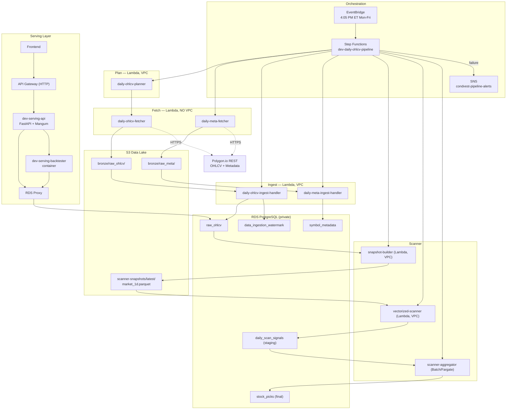

# TradLyte Data Platform — Architecture Reference

A serverless, event-driven market-data platform on AWS, following a Batch + Serving (Lambda Architecture) pattern:

- **Batch Layer** — ingests daily OHLCV + symbol metadata and runs the daily strategy scanner at market close.
- **Serving Layer** — REST APIs for screener, picks, market data, and backtest.
- **Speed Layer** — designed but archived (Kinesis/Flink path in `cloud/speed_layer/Archive/`).

Two structural rules: no real-time streaming in the MVP, and strict separation between **fetch (stateless, no VPC)** and **ingest (VPC, private DB)** so external egress and private DB access never share blast radius.

## High-level architecture

The authoritative diagram lives at [`docs/data_architecture.mmd`](docs/data_architecture.mmd).

## Daily flow

| Stage | Component | Runtime | What it does |
|---|---|---|---|
| 0 — Plan | `daily-ohlcv-planner` | Lambda (VPC) | Reads the watermark, derives missing dates, fans out fetcher invokes |
| 1 — Fetch | `daily-ohlcv-fetcher`, `daily-meta-fetcher` | Lambda (no VPC) | Pull Polygon → S3 bronze (parquet OHLCV + JSON metadata manifest) |
| 2 — Ingest | `daily-ohlcv-ingest-handler`, `daily-meta-ingest-handler` | Lambda (VPC) | Upsert S3 bronze → RDS; update SCD-2 watermark |
| 3 — Snapshot | `scanner-snapshot-builder` | Lambda (VPC) | Dedupe/trim RDS 1d bars → long-format `market_1d.parquet` in S3 |
| 4 — Scan | `vectorized-scanner` | Lambda (VPC) | Read snapshot, run every strategy across the whole universe in one Polars pass (1d anchor + 3d/5d confirm), write `daily_scan_signals` |
| 5 — Aggregate | `scanner-aggregator` | Batch/Fargate | Rank globally across the universe, write `stock_picks`, clear staging |

EventBridge triggers the Step Functions pipeline Mon–Fri at 4:05 PM ET; any stage failure routes to the SNS alert topic. Multi-timeframe bars (3d/5d) are resampled on the fly from 1d — no silver tables are persisted.

## Component inventory

### Batch layer
| Component | AWS resource | Network |
|---|---|---|
| OHLCV fetcher | `dev-batch-daily-ohlcv-fetcher` (Lambda) | No VPC |
| Meta fetcher | `dev-batch-daily-meta-fetcher` (Lambda) | No VPC |
| Planner | `dev-batch-daily-ohlcv-planner` (Lambda) | VPC |
| OHLCV ingest | `dev-batch-daily-ohlcv-ingest-handler` (Lambda) | VPC |
| Meta ingest | `dev-batch-daily-meta-ingest-handler` (Lambda) | VPC |
| Snapshot builder | `dev-batch-scanner-snapshot-builder` (Lambda) | VPC |
| Vectorized scanner | `dev-batch-vectorized-scanner` (Lambda) | VPC |
| Aggregator | `dev-batch-scanner-aggregator` (Batch/Fargate) | VPC |
| Orchestrator | `dev-daily-ohlcv-pipeline` (Step Functions) + EventBridge schedule | — |

### Shared libraries (`cloud/shared/`)
| Package | Responsibility |
|---|---|
| `shared.clients` | RDS client (connection + upsert + watermark) and Polygon REST wrapper |
| `shared.models.data_models` | Pydantic DTOs |
| `shared.utils` | Watermark + 5-year retention helpers; US/Eastern trading-day arithmetic |
| `shared.analytics_core` | Strategy engine: `indicators/`, `strategies/` (base + builder + library), `vectorized_scanner.py`, `scanner.py`, `backtester.py`, `executor.py`, `inputs.py`, `models.py` |

### Serving layer
| Component | AWS resource | What it does |
|---|---|---|
| Serving API | `dev-serving-api` (Lambda, FastAPI + Mangum) | Screener / picks / market routes + `POST /v1/backtest` |
| Backtester | `dev-serving-backtester` (Lambda, container) | Single-symbol strategy backtest |
| RDS Proxy | `dev-rds-proxy-v2` | Pooled DB access for the serving path |
| API Gateway | `dev-serving-http-api` (HTTP API, stage `v1`) | Routing, throttling, CORS |

### Storage
| Store | Purpose |
|---|---|
| S3 (`dev-condvest-datalake`) | Bronze OHLCV/metadata, scanner snapshot |
| RDS PostgreSQL (private) | `raw_ohlcv` (5-yr), `symbol_metadata`, watermark, `daily_scan_signals`, `stock_picks` |
| Secrets Manager | Polygon API key, RDS credentials |

### Database tables
| Table | Key | Role |
|---|---|---|
| `symbol_metadata` | `symbol` | Symbol reference data |
| `raw_ohlcv` | `(symbol, timestamp, interval)` | Daily bars, 5-year retention |
| `data_ingestion_watermark` | `watermark_id` | Per-symbol ingestion cursor (SCD Type 2) |
| `daily_scan_signals` | `(scan_date, symbol, strategy_name)` | Scanner staging (cleared each day) |
| `stock_picks` | `(scan_date, symbol, strategy_name)` | Final ranked picks |

## Related docs

- [`cloud/README.md`](cloud/README.md) — cloud folder map
- [`cloud/batch_layer/infrastructure/orchestration/README.md`](cloud/batch_layer/infrastructure/orchestration/README.md) — Step Functions operations
- [`cloud/serving_layer/API_GUIDE.md`](cloud/serving_layer/API_GUIDE.md) — HTTP API contract
- [`docs/data_architecture.mmd`](docs/data_architecture.mmd) — diagram source
